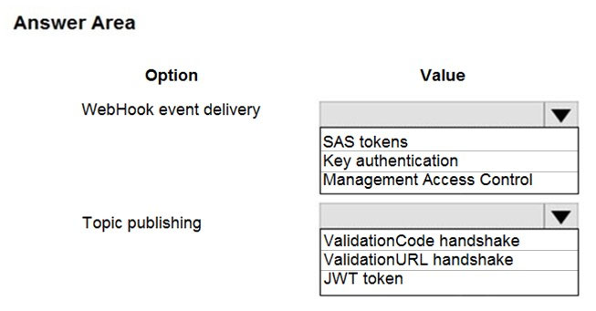

# Microsoft Azure AZ-204: Desenvolvendo Soluções para Microsoft Azure - Testes Práticos e Exames

Este repositório contém testes práticos e questões de exame para a certificação Microsoft Azure AZ-204: Desenvolvendo Soluções para Microsoft Azure.

## Índice

- [Sobre a Certificação](#sobre-a-certificação)
- [Estrutura do Exame](#estrutura-do-exame)
- [Testes Práticos](#testes-práticos)
- [Questões de Exame](#questões-de-exame)
- [Recursos Adicionais](#recursos-adicionais)

## Sobre a Certificação

A certificação AZ-204: Desenvolvendo Soluções para Microsoft Azure é projetada para desenvolvedores que desejam demonstrar suas habilidades em:

- Desenvolvimento de soluções baseadas em nuvem
- Implementação de serviços de armazenamento do Azure
- Implementação de segurança
- Monitoramento, solução de problemas e otimização de soluções do Azure

## Estrutura do Exame

O exame AZ-204 cobre os seguintes domínios:

1. Desenvolvimento de soluções de computação do Azure (25-30%)
2. Desenvolvimento para armazenamento do Azure (15-20%)
3. Implementação de segurança do Azure (20-25%)
4. Monitoramento, solução de problemas e otimização de soluções do Azure (15-20%)
5. Conectando e consumindo serviços do Azure e APIs de terceiros (15-20%)

## Testes Práticos

Os testes práticos incluídos neste repositório são baseados em cenários reais e cobrem todos os domínios do exame. Cada teste inclui:

- Questões de múltipla escolha
- Cenários práticos
- Explicações detalhadas das respostas

## Questões de Exame

### Você está desenvolvendo uma solução para um serviço de entrega móvel. Você está desenvolvendo um aplicativo móvel que os usuários podem usar para fazer pedidos de um restaurante em sua área. O aplicativo usa o seguinte fluxo de trabalho: 1. Um motorista seleciona os restaurantes para os quais fará entregas. 2. Os pedidos são enviados para todos os motoristas disponíveis em uma área. 3. Apenas pedidos dos restaurantes selecionados aparecerão para o motorista. 4. O primeiro motorista a aceitar um pedido o remove da lista de pedidos disponíveis. Você precisa implementar uma solução Azure Service Bus. Quais três ações você deve realizar em sequência?

- [x] Caixa 1: Criar um único tópico do Service Bus. Caixa 2: Criar um Namespace do Service Bus para cada restaurante para o qual um motorista pode receber mensagens. Caixa 3: Criar uma assinatura do Service Bus para cada restaurante para o qual um motorista pode receber pedidos.
- [ ] Caixa 1: Criar uma assinatura do Service Bus para cada restaurante para o qual um motorista pode receber pedidos. Caixa 2: Criar um tópico do Service Bus para cada restaurante. Caixa 3: Criar um Namespace do Service Bus para cada um.
- [ ] Caixa 1: Criar um único tópico do Service Bus. Caixa 2: Criar uma assinatura do Service Bus para cada restaurante para o qual um motorista pode receber pedidos. Caixa 3: Criar um único tópico do Service Bus.
- [ ] Caixa 1: Criar um único tópico do Service Bus. Caixa 2: Criar um Namespace do Service Bus para cada restaurante para o qual um motorista pode receber mensagens. Caixa 3: Criar um Namespace do Service Bus para cada um.

**[⬆ Voltar ao Topo](#índice)**

### Você está desenvolvendo um aplicativo de notícias e conteúdo de blog para dispositivos Windows. Uma notificação deve chegar ao dispositivo do usuário quando houver um novo artigo disponível para visualização. Você precisa implementar notificações push. Como você deve completar o segmento de código?

- [x] Caixa 1: `NotificationHubClient`. Caixa 2: `NotificationHubClient`. Caixa 3: `CreateClientFromConnectionString`. Caixa 4: `SendWindowsNativeNotificationAsync`.
- [ ] Caixa 1: `NotificationHubJob`. Caixa 2: `NotificationHubJob`. Caixa 3: `PatchInstallation`. Caixa 4: `SendWindowsNativeNotificationAsync`.
- [ ] Caixa 1: `NotificationHubClientSettings`. Caixa 2: `NotificationHubClientSettings`. Caixa 3: `CreateOrUpdatelnstallation`. Caixa 4: `ScheduleNotificationAsync`.
- [ ] Caixa 1: `NotificationHubClientSettings`. Caixa 2: `NotificationDetails`. Caixa 3: `CreateOrUpdatelnstallation`. Caixa 4: `SendWindowsNativeNotificationAsync`.

**[⬆ Voltar ao Topo](#índice)**

### Você está desenvolvendo uma solução de mensageria do Azure. Você precisa garantir que a solução atenda aos seguintes requisitos: Fornecer suporte transacional. Fornecer detecção de duplicatas. Armazenar as mensagens por um período ilimitado de tempo. Quais duas tecnologias atenderão aos requisitos?

- [x] Tópico do Azure Service Bus.
- [x] Fila do Azure Service Bus.
- [ ] Fila do Azure Storage.
- [ ] Azure Event Hub.

**[⬆ Voltar ao Topo](#índice)**

### Você está desenvolvendo uma solução de gateway para uma API de notícias voltada para o público. O back-end da API de notícias é implementado como um serviço RESTful e hospedado em uma instância do Azure App Service. Você precisa configurar a autenticação de back-end para a instância do serviço de Gerenciamento de API. Qual tipo de destino e credencial de gateway você deve usar?

- [ ] Destino: Recurso do Azure. Credenciais de gateway: Certificado de cliente.
- [ ] Destino: Certificado de cliente. Credenciais de gateway: Básico.
- [ ] Destino: Recurso do Azure. Credenciais de gateway: Básico.
- [x] Destino: Endpoint HTTP(s). Credenciais de gateway: Certificado de cliente.

**[⬆ Voltar ao Topo](#índice)**

### Você está criando um aplicativo que usa o Event Grid para se conectar com outros serviços. Os dados de eventos do seu aplicativo serão enviados para uma função serverless que verifica a conformidade. Esta função é mantida pela sua empresa. Você escreve uma nova assinatura de evento no escopo do seu recurso. O evento deve ser invalidado após um período específico de tempo. Você precisa configurar o Event Grid. O que você deve fazer?

- [x] Entrega de WebHook: Tokens SAS. Publicação de tópico: Handshake ValidationCode.
- [ ] Entrega de WebHook: Autenticação por chave. Publicação de tópico: Handshake ValidationCode.
- [ ] Entrega de WebHook: Controle de Acesso de Gerenciamento. Publicação de tópico: Handshake ValidationURL.
- [ ] Entrega de WebHook: Tokens SAS. Publicação de tópico: Handshake ValidationURL.

**[⬆ Voltar ao Topo](#índice)**

### Você está trabalhando para a Contoso, Ltd. Você define um objeto de Política de API usando a seguinte marcação XML. Questão 1: O segmento XML pertence à seção `<inbound>` da política.

- [x] Sim.
- [ ] Não.

**[⬆ Voltar ao Topo](#índice)**

### Você está trabalhando para a Contoso, Ltd. Você define um objeto de Política de API usando a seguinte marcação XML. Questão 2: Se o tamanho do corpo for >256k, ocorrerá um erro.

- [ ] Sim.
- [x] Não.

**[⬆ Voltar ao Topo](#índice)**

### Você está trabalhando para a Contoso, Ltd. Você define um objeto de Política de API usando a seguinte marcação XML. Questão 3: Se a requisição for `<http://contoso.com/api/9.2/>`, a política manterá a versão mais alta.

- [ ] Sim.
- [x] Não.

**[⬆ Voltar ao Topo](#índice)**

### Você está desenvolvendo uma solução de gateway para uma API de notícias voltada para o público. O back-end da API de notícias é implementado como um serviço RESTful e usa uma especificação OpenAPI. Você precisa garantir que possa acessar a API de notícias usando uma instância do serviço de Gerenciamento de API do Azure. Qual comando do Azure PowerShell você deve executar?

- [x] `Import-AzureRmApiManagementApi -Context $ApiMgmtContext -SpecificationFormat 'Swagger' -SpecificationPath $SwaggerPath -Path $Path`.
- [ ] `New-AzureRmApiManagementBackend -Context $ApiMgmtContext-Url $Url -Protocol http`.
- [ ] `New-AzureRmApiManagement -ResourceGroupName $ResourceGroup -Name $Name 'Location $Location -Organization $Org -AdminEmail $AdminEmail`.
- [ ] `New-AzureRmApiManagementBackendProxy -Url $ApiUrl`.

**[⬆ Voltar ao Topo](#índice)**

### Você está desenvolvendo uma função do Azure que se conecta a uma instância do Azure SQL Database. A função é acionada por uma fila do Azure Storage. Você recebe relatórios de várias System.InvalidOperationExceptions com a seguinte mensagem: 'Tempo limite expirado. O período de tempo limite decorreu antes de obter uma conexão do pool. Isso pode ter ocorrido porque todas as conexões em pool estavam em uso e o tamanho máximo do pool foi atingido.' Você precisa evitar a exceção. O que você deve fazer?

- [ ] No arquivo `host.json`, diminuir o valor da opção batchSize.
- [ ] Converter o gatilho para Azure Event Hub.
- [x] Converter a Função do Azure para o plano Premium.
- [ ] No arquivo `function.json`, alterar o valor da opção type para queueScaling.

**[⬆ Voltar ao Topo](#índice)**

### Você está desenvolvendo um serviço web REST. Os clientes acessarão o serviço usando uma instância do Azure API Management. O serviço web não lida corretamente com conflitos. Em vez de retornar um código de status HTTP 409, o serviço retorna um código de status 500. O corpo da mensagem de status contém apenas a palavra conflito. Você precisa garantir que os conflitos produzam a resposta correta. Como você deve completar a política?

- [x] Caixa 1: `on-error`. Caixa 2: `context`. Caixa 3: `context`. Caixa 4: `set-status`. Caixa 5: `on-error`.
- [ ] Caixa 1: `when-error`. Caixa 2: `context`. Caixa 3: `server`. Caixa 4: `override-status`. Caixa 5:`on-error`.
- [ ] Caixa 1: `when-error`. Caixa 2: `context`. Caixa 3: `context`. Caixa 4: `set-status`. Caixa 5:`on-error`.
- [ ] Caixa 1: `on-error`. Caixa 2: `context`. Caixa 3: `server`. Caixa 4: `override-status`. Caixa 5:`on-error`.

**[⬆ Voltar ao Topo](#índice)**

### Você é um desenvolvedor para uma empresa de Software como Serviço (SaaS). Você desenvolve soluções que fornecem a capacidade de enviar notificações usando Azure Notification Hubs. Você precisa criar um código de exemplo que os clientes possam usar como referência para como enviar notificações brutas para dispositivos Windows Push Notification Services (WNS). O código de exemplo não deve usar pacotes externos. Como você deve completar o segmento de código?

- [x] Caixa 1: `windows`. Caixa 2: `application/octet-stream`.
- [ ] Caixa 1: `windowsphone`. Caixa 2: `raw`.
- [ ] Caixa 1: `windows`. Caixa 2: `application/json`.
- [ ] Caixa 1: `windowsphone`. Caixa 2: `application/xml`.

**[⬆ Voltar ao Topo](#índice)**

### Você desenvolve e implanta um aplicativo web ASP.NET no Azure App Service. Você usa telemetria do Application Insights para monitorar o aplicativo. Você deve testar o aplicativo para garantir que ele esteja disponível e responsivo de vários pontos ao redor do mundo e em intervalos regulares. Se o aplicativo não estiver respondendo, você deve enviar um alerta para a equipe de suporte. Você precisa configurar um teste para o aplicativo web. Quais dois tipos de teste você pode usar?

- [ ] Integração.
- [x] TrackAvailablity.
- [x] URL ping.
- [ ] Unitário.
- [ ] Carga.

**[⬆ Voltar ao Topo](#índice)**

### Você está desenvolvendo uma solução do Azure para coletar dados de inventário de milhares de lojas localizadas em todo o mundo. Cada local de loja enviará os dados de inventário por hora para uma conta de armazenamento do Azure Blob para processamento. A solução deve atender aos seguintes requisitos: Iniciar o processamento quando os dados forem salvos no Azure Blob storage. Filtrar dados com base nas informações de localização da loja. Acionar um Azure Logic App para processar os dados para saída no Azure Cosmos DB. Habilitar alta disponibilidade e distribuição geográfica. Permitir 24 horas para novas tentativas. Implementar um processamento de dados com retirada exponencial. Você precisa configurar a solução. O que você deve implementar?

- [ ] Fonte de Evento: Azure Event Grid. Receptor de Evento: Azure Logic App. Manipulador de Evento: Azure Service Bus.
- [ ] Fonte de Evento: Azure Service Bus. Receptor de Evento: Azure App Service. Manipulador de Evento: Azure Blob Storage.
- [ ] Fonte de Evento: Azure Event Grid. Receptor de Evento: Azure Service Bus. Manipulador de Evento: Azure Blob Storage.
- [x] Fonte de Evento: Azure Blob Storage. Receptor de Evento: Azure Event Grid. Manipulador de Evento: Azure Logic App.

**[⬆ Voltar ao Topo](#índice)**

### Determine se a solução atende aos objetivos declarados. Você está desenvolvendo e implantando vários aplicativos web ASP.NET no Azure App Service. Você planeja salvar informações de estado de sessão e saída HTML. Você deve usar um mecanismo de armazenamento com os seguintes requisitos: Compartilhar o estado da sessão em todos os aplicativos web ASP.NET. Suportar acesso controlado e concorrente aos mesmos dados de estado de sessão para vários leitores e um único escritor. Salvar respostas HTTP completas para solicitações concorrentes. Você precisa armazenar as informações. Solução Proposta: Habilitar o Application Request Routing (ARR). A solução atende ao objetivo?

- [ ] Sim.
- [x] Não.

**[⬆ Voltar ao Topo](#índice)**

### Determine se a solução atende aos objetivos declarados. Você está desenvolvendo e implantando vários aplicativos web ASP.NET no Azure App Service. Você planeja salvar informações de estado de sessão e saída HTML. Você deve usar um mecanismo de armazenamento com os seguintes requisitos: Compartilhar o estado da sessão em todos os aplicativos web ASP.NET. Suportar acesso controlado e concorrente aos mesmos dados de estado de sessão para vários leitores e um único escritor. Salvar respostas HTTP completas para solicitações concorrentes. Você precisa armazenar as informações. Solução Proposta: Implantar e configurar um Azure Database for PostgreSQL. Atualizar os aplicativos web. A solução atende ao objetivo?

- [ ] Sim.
- [x] Não.

**[⬆ Voltar ao Topo](#índice)**

### Determine se a solução atende aos objetivos declarados. Você está desenvolvendo e implantando vários aplicativos web ASP.NET no Azure App Service. Você planeja salvar informações de estado de sessão e saída HTML. Você deve usar um mecanismo de armazenamento com os seguintes requisitos: Compartilhar o estado da sessão em todos os aplicativos web ASP.NET. Suportar acesso controlado e concorrente aos mesmos dados de estado de sessão para vários leitores e um único escritor. Salvar respostas HTTP completas para solicitações concorrentes. Você precisa armazenar as informações. Solução Proposta: Implantar e configurar o Azure Cache for Redis. Atualizar os aplicativos web. A solução atende ao objetivo?

- [x] Sim.
- [ ] Não.

**[⬆ Voltar ao Topo](#índice)**

### Uma empresa está desenvolvendo uma plataforma de jogos. Os usuários podem se juntar a equipes para jogar online e ver placares que incluem estatísticas dos jogadores. A solução inclui uma entidade chamada `Team`. Você planeja implementar uma instância do Azure Redis Cache para melhorar a eficiência das operações de dados para entidades que raramente mudam. Você precisa invalidar o cache quando os dados da equipe são alterados. Como você deve completar o código?

- [x] Caixa 1: `IDatabase cache = Connection.GetDatabase();`. Caixa 2: `cache.StringSet('Team', '');`.
- [ ] Caixa 1: `IDatabase cache = Connection.GetDatabase();`. Caixa 2: `cache ValueDelete('Team');`.
- [ ] Caixa 1: `ICache cache = Connection.GetDatabase();`. Caixa 2: `cache KeyDelete('Team');`.
- [ ] Caixa 1: `ICache cache = Connection.GetDatabase();`. Caixa 2: `cache StringGet('Team', '');`.

**[⬆ Voltar ao Topo](#índice)**

### Uma empresa tem vários armazéns. Cada armazém contém dispositivos IoT de temperatura que entregam dados de temperatura para uma fila do Azure Service Bus. Você precisa enviar alertas por email para os supervisores das instalações imediatamente se a temperatura em um armazém ficar acima ou abaixo das temperaturas limite especificadas. Quais cinco ações você deve realizar em sequência?

- [x] Caixa 1: Criar um Logic app em branco. Caixa 2: Adicionar um gatilho de logic app que é acionado quando uma ou mais mensagens chegam na fila. Caixa 3: Adicionar uma ação que lê dados de temperatura IoT da fila do Service Bus. Caixa 4: Adicionar uma condição que compara a temperatura com os limites superior e inferior. Caixa 5: Adicionar uma ação que envia um email para o pessoal especificado se a temperatura estiver fora desses limites.
- [ ] Caixa 1: Adicionar um gatilho que lê dados de temperatura IoT de uma fila do Service Bus. Caixa 2: Adicionar uma condição que compara a temperatura com os limites superior e inferior. Caixa 3: Adicionar uma ação de logic app que é acionada quando uma ou mais mensagens chegam na fila. Caixa 4: Criar um Logic app em branco. Caixa 5: Adicionar uma ação que envia um email para o pessoal especificado se a temperatura estiver fora desses limites.
- [ ] Caixa 1: Adicionar uma condição que compara a temperatura com os limites superior e inferior. Caixa 2: Saída. Caixa 3: Adicionar um gatilho de recorrência que agenda o aplicativo para ser executado a cada 15 minutos. Caixa 4: Adicionar um gatilho que lê dados de temperatura IoT de uma fila do Service Bus. Caixa 5: Criar um Logic app em branco.
- [ ] Caixa 1: Criar um Logic app em branco. Caixa 2: Adicionar uma ação de logic app que é acionada quando uma ou mais mensagens chegam na fila. Caixa 3: Adicionar uma condição que compara a temperatura com os limites superior e inferior. Caixa 4: Adicionar uma ação que lê dados de temperatura IoT da fila do Service Bus. Caixa 5: Adicionar uma condição que compara a temperatura com os limites superior e inferior.

**[⬆ Voltar ao Topo](#índice)**

### Você está criando um sistema de notificação de perigo que tem um único servidor de sinalização que aciona alarmes de áudio e visuais para iniciar e parar. Você implementa o Azure Service Bus para publicar alarmes. Cada controlador de alarme usa o Azure Service Bus para receber sinais de alarme como parte de uma transação. Os eventos de alarme devem ser registrados para fins de auditoria. Cada registro de transação deve incluir informações sobre o tipo de alarme que foi ativado. Você precisa implementar uma solução de auditoria de trilha de resposta. Quais duas ações você deve realizar?

- [x] Atribuir o valor da propriedade `SessionID` da mensagem de perigo à propriedade `ReplyToSessionId`.
- [ ] Atribuir o valor da propriedade `MessageId` da mensagem de perigo à propriedade `DevileryCount`.
- [ ] Atribuir o valor da propriedade `SessionID` da mensagem de perigo à propriedade `SequenceNumber`.
- [x] Atribuir o valor da propriedade `MessageId` da mensagem de perigo à propriedade `CorrelationId`.
- [ ] Atribuir o valor da propriedade `SequenceNumber` da mensagem de perigo à propriedade `DeliveryCount`.
- [ ] Atribuir o valor da propriedade `MessageId` da mensagem de perigo à propriedade `SequenceNumber`.

**[⬆ Voltar ao Topo](#índice)**

### Você está desenvolvendo aplicativos para uma empresa. Você planeja hospedar os aplicativos no Azure App Services. A empresa tem os seguintes requisitos: A cada cinco minutos verificar se os sites estão responsivos. Verificar se os sites respondem dentro de um limite de tempo especificado. Solicitações dependentes, como imagens e arquivos JavaScript, devem carregar corretamente. Gerar alertas se um site estiver com problemas. Se um site falhar ao carregar, o sistema deve tentar recarregar o site mais três vezes. Você precisa implementar este processo com o mínimo de esforço. O que você deve fazer?

- [ ] Criar um teste web Selenium e configurá-lo para ser executado da sua estação de trabalho como uma tarefa agendada.
- [x] Configurar um teste de ping de URL para consultar a página inicial.
- [ ] Criar uma função do Azure para consultar a página inicial.
- [ ] Criar um teste web de várias etapas para consultar a página inicial.
- [ ] Criar um Teste de Disponibilidade Personalizado para consultar a página inicial.

**[⬆ Voltar ao Topo](#índice)**

### Você desenvolve e adiciona várias funções a um aplicativo de Função do Azure que usa o host de runtime mais recente. As funções contêm vários endpoints de API REST protegidos usando SSL. O aplicativo de Função do Azure é executado em um plano de Consumo. Você deve enviar um alerta quando qualquer um dos endpoints de função estiver indisponível ou respondendo muito lentamente. Você precisa monitorar a disponibilidade e a responsividade das funções. O que você deve fazer?

- [ ] Criar um teste de ping de URL.
- [x] Criar uma função acionada por timer que chama `TrackAvailability()` e envia os resultados para o Application Insights.
- [ ] Criar uma função acionada por timer que chama `GetMetric('Request Size')` e envia os resultados para o Application Insights.
- [ ] Adicionar uma nova configuração de diagnóstico ao aplicativo de Função do Azure. Habilitar as opções `FunctionAppLogs` e Enviar para Log Analytics.

**[⬆ Voltar ao Topo](#índice)**

### Você está desenvolvendo uma solução de comércio eletrônico que usa uma arquitetura de microsserviços. Você precisa projetar um backplane de comunicação para comunicar mensagens transacionais entre várias partes da solução. As mensagens devem ser comunicadas em ordem primeiro a entrar, primeiro a sair (FIFO). O que você deve usar?

- [ ] Fila do Azure Storage.
- [ ] Azure Event Hub.
- [x] Azure Service Bus.
- [ ] Azure Event Grid.

**[⬆ Voltar ao Topo](#índice)**

### Você está desenvolvendo um aplicativo de serviço do Azure que processa dados de fila quando recebe uma mensagem de um aplicativo móvel. As mensagens podem não ser enviadas ao serviço consistentemente. Você tem os seguintes requisitos: O tamanho da fila não deve crescer mais que 80 gigabytes (GB). Usar ordenação primeiro a entrar, primeiro a sair (FIFO) de mensagens. Minimizar os custos do Azure. Você precisa implementar a solução de mensageria. Solução: Use a API .Net para adicionar uma mensagem a uma Fila do Azure Service Bus a partir do aplicativo móvel. Crie um Aplicativo de Função do Azure que usa um gatilho de Fila do Azure Service Bus. A solução atende ao objetivo?

- [x] Sim.
- [ ] Não.

**[⬆ Voltar ao Topo](#índice)**

### Você está desenvolvendo uma solução do Azure para coletar dados de dispositivos de ponto de venda (POS) de 2.000 lojas localizadas em todo o mundo. Um único dispositivo pode produzir 2 megabytes (MB) de dados a cada 24 horas. Cada local de loja tem um a cinco dispositivos que enviam dados. Você deve armazenar os dados do dispositivo no Azure Blob storage. Os dados do dispositivo devem ser correlacionados com base em um identificador de dispositivo. Lojas adicionais devem ser abertas no futuro. Você precisa implementar uma solução para receber os dados do dispositivo. Solução: Provisionar um Azure Event Hub. Configurar o identificador da máquina como a chave de partição e habilitar a captura. A solução atende ao objetivo?

- [x] Sim.
- [ ] Não.

**[⬆ Voltar ao Topo](#índice)**

### Uma empresa está desenvolvendo uma solução que permite que geladeiras inteligentes enviem informações de temperatura para um local central. A solução deve receber e armazenar mensagens até que possam ser processadas. Você cria uma instância do Azure Service Bus fornecendo um nome, nível de preço, assinatura, grupo de recursos e localização. Você precisa completar a configuração. Qual comando do Azure CLI ou PowerShell você deve executar?

- [ ] `az group create --name fridge-rg --location fridge-loc`.
- [ ] `New-AzureRmServiceBusNamespace -ResourceGroupName fridge-rg -NamespaceName fridge-ns -Location fridge-loc`.
- [x] `New-AzureRmServiceBusQueue -ResourceGroupName fridge-rg -NamespaceName fridge-ns -Name fridge-q -EnablePartitioning $False`.
- [ ] `az servicebus namespace create --resource-group fridge-rg --name fridge-rg --location fridge-loc`.

**[⬆ Voltar ao Topo](#índice)**

### Sua empresa tem um aplicativo web chamado `WebApp1`. Você usa o WebJobs SDK para projetar uma tarefa em segundo plano do App Service acionada que invoca automaticamente uma função no código sempre que novos dados são recebidos em uma fila. Você está se preparando para configurar o serviço processa um item de dados da fila. Qual dos seguintes é o serviço que você deve usar?

- [ ] Logic Apps.
- [x] WebJobs.
- [ ] Flow.
- [ ] Functions.

**[⬆ Voltar ao Topo](#índice)**

### Sua empresa tem uma assinatura do Azure. Você precisa implantar várias máquinas virtuais do Azure na assinatura usando modelos do Azure Resource Manager (ARM). As máquinas virtuais serão incluídas em um único conjunto de disponibilidade. Você precisa garantir que o modelo ARM permita que o maior número possível de máquinas virtuais permaneça acessível em caso de falha de malha ou manutenção. Qual dos seguintes é o valor que você deve configurar para a propriedade `platformFaultDomainCount`?

- [ ] 10.
- [ ] 30.
- [ ] Valor Mínimo.
- [x] Valor Máximo.

**[⬆ Voltar ao Topo](#índice)**

### Você tem dois hosts Hyper-V chamados `Host1` e `Host2`. O Host1 tem uma máquina virtual do Azure chamada `VM1` que foi implantada usando um modelo personalizado do Azure Resource Manager. Você precisa mover `VM1` para `Host2`. O que você deve fazer?

- [ ] Na lâmina `Update management`, clique em Habilitar.
- [ ] Na lâmina `Overview`, mova `VM1` para uma assinatura diferente.
- [x] Na lâmina `Redeploy`, clique em Redeploy.
- [ ] Na lâmina `Profile`, modifique o local de uso.

**[⬆ Voltar ao Topo](#índice)**

### Sua empresa tem um cluster do Azure Kubernetes Service (AKS) que você gerencia a partir de um dispositivo unido ao Azure AD. O cluster está localizado em um grupo de recursos. Os desenvolvedores criaram um aplicativo chamado `MyApp`. `MyApp` foi empacotado em uma imagem de contêiner. Você precisa implantar o arquivo de manifesto YAML para o aplicativo. Solução: Você instala o Azure CLI no dispositivo e executa o comando `kubectl apply -f myapp.yaml`. Isso atende ao objetivo?

- [x] Sim.
- [ ] Não.

**[⬆ Voltar ao Topo](#índice)**

### Sua empresa tem um cluster do Azure Kubernetes Service (AKS) que você gerencia a partir de um dispositivo unido ao Azure AD. O cluster está localizado em um grupo de recursos. Os desenvolvedores criaram um aplicativo chamado `MyApp`. `MyApp` foi empacotado em uma imagem de contêiner. Você precisa implantar o arquivo de manifesto YAML para o aplicativo. Solução: Você instala o cliente docker no dispositivo e executa o comando `docker run -it microsoft/azure-cli:0.10.17`. Isso atende ao objetivo?

- [ ] Sim.
- [x] Não.

**[⬆ Voltar ao Topo](#índice)**

### Sua empresa tem uma assinatura do Azure. Você precisa implantar várias máquinas virtuais do Azure na assinatura usando modelos do Azure Resource Manager (ARM). As máquinas virtuais serão incluídas em um único conjunto de disponibilidade. Você precisa garantir que o modelo ARM permita que o maior número possível de máquinas virtuais permaneça acessível em caso de falha de malha ou manutenção. Qual dos seguintes é o valor que você deve configurar para a propriedade platformUpdateDomainCount?

- [ ] 10.
- [ ] 20.
- [ ] 30.
- [x] 40.

**[⬆ Voltar ao Topo](#índice)**

### Você está projetando um WebJob do Azure que será executado nas mesmas instâncias que um aplicativo web. Você deseja fazer uso de um tipo de WebJob adequado. O tipo de webjob também deve permitir a opção de restringir o WebJob a uma única instância. Solução: Você configura o uso do tipo WebJob Acionado. A solução atende ao objetivo?

- [ ] Sim.
- [x] Não.

**[⬆ Voltar ao Topo](#índice)**

### Você está projetando um WebJob do Azure que será executado nas mesmas instâncias que um aplicativo web. Você deseja fazer uso de um tipo de WebJob adequado. O tipo de webjob também deve permitir a opção de restringir o WebJob a uma única instância. Solução: Você configura o uso do tipo WebJob Contínuo. A solução atende ao objetivo?

- [x] Sim.
- [ ] Não.

**[⬆ Voltar ao Topo](#índice)**

### Sua empresa tem uma implantação local do MongoDB e uma conta do Azure Cosmos DB que faz uso da API do MongoDB. Você precisa elaborar uma estratégia para migrar o MongoDB para a conta do Azure Cosmos DB. Você inclui a ferramenta [Data Management Gateway] em sua estratégia de migração.

- [ ] Nenhuma alteração necessária.
- [x] mongorestore.
- [ ] Azure Storage Explorer.
- [ ] `AzCopy`.

**[⬆ Voltar ao Topo](#índice)**

### Você está desenvolvendo um aplicativo que processa eventos do Azure Blob storage. Seu aplicativo tem os seguintes requisitos: Processar logs de transação de forma assíncrona para alterações que ocorrem nos blobs e nos metadados dos blobs. Processar alterações na ordem em que ocorreram. Manter alterações por razões de conformidade. Solução: Você usa o Azure Event Grid com um aplicativo de função do Azure assinante. A solução atende ao objetivo?

- [x] Sim.
- [ ] Não.

**[⬆ Voltar ao Topo](#índice)**

### Você está desenvolvendo um aplicativo que processa eventos do Azure Blob storage. Seu aplicativo tem os seguintes requisitos: Processar logs de transação de forma assíncrona para alterações que ocorrem nos blobs e nos metadados dos blobs. Processar alterações na ordem em que ocorreram. Manter alterações por razões de conformidade. Solução: Você usa a API HTTP Data Collector do Azure Monitor. A solução atende ao objetivo?

- [ ] Sim.
- [x] Não.

**[⬆ Voltar ao Topo](#índice)**

### Você está desenvolvendo um aplicativo móvel que usa um Azure SQL Database chamado `Weyland`. O banco de dados contém uma tabela chamada Customers que tem um campo chamado `email_address`. Você deseja implementar mascaramento dinâmico de dados para ocultar os dados no campo `email_address`. Solução: Você executa a seguinte instrução transact-SQL: `ALTER TABLE [dbo].[Weyland].[Customers] ALTER COLUMN [email_address] ADD MASKED WITH (FUNCTION = 'email()')`. A solução atende ao objetivo?

- [x] Sim.
- [ ] Não.

**[⬆ Voltar ao Topo](#índice)**

### Você está desenvolvendo um aplicativo móvel que usa um Azure SQL Database chamado `Weyland`. O banco de dados contém uma tabela chamada Customers que tem um campo chamado `email_address`. Você deseja implementar mascaramento dinâmico de dados para ocultar os dados no campo `email_address`. Solução: Você executa o cmdlet Powershell `Set-AzSqlDatabaseDataMaskingPolicy -DatabaseName 'Weyland'`. A solução atende ao objetivo?

- [ ] Sim.
- [x] Não.

**[⬆ Voltar ao Topo](#índice)**

### Você está desenvolvendo um aplicativo móvel que usa um Azure SQL Database chamado `Weyland`. O banco de dados contém uma tabela chamada Customers que tem um campo chamado `email_address`. Você deseja implementar mascaramento dinâmico de dados para ocultar os dados no campo `email_address`. Solução: Você executa o cmdlet Powershell `Set-AzSqlDatabaseDataMaskingRule -DatabaseName 'Weyland' -SchemaName 'dbo' -TableName 'Customers' -ColumnName 'email_address' -MaskingFunction 'email'`. A solução atende ao objetivo?

- [x] Sim.
- [ ] Não.

**[⬆ Voltar ao Topo](#índice)**

### Você está desenvolvendo um Aplicativo Web de Comércio Eletrônico. Você deseja usar o Azure Key Vault para garantir que os logins no Aplicativo Web de Comércio Eletrônico sejam protegidos usando a autenticação do Azure App Service e o Azure Active Directory (AAD). O que você deve fazer no Aplicativo Web de Comércio Eletrônico?

- [ ] Executar o comando `az keyvault secret`.
- [ ] Habilitar o Azure AD Connect.
- [x] Habilitar a Identidade Gerenciada de Serviço (MSI).
- [ ] Criar uma entidade de serviço do Azure AD.

**[⬆ Voltar ao Topo](#índice)**

### Você está desenvolvendo um aplicativo web que usa o Azure Active Directory (Azure AD) para autenticação. Você deseja configurar o aplicativo web para usar autenticação multifator. O que você deve fazer?

- [ ] Habilitar autenticação de aplicativo móvel.
- [ ] No acesso condicional do Azure AD, habilitar a política de linha de base.
- [x] No Azure AD, criar uma política de acesso condicional.
- [ ] Instalar o Servidor de Autenticação Multifator do Azure.

**[⬆ Voltar ao Topo](#índice)**

### Você está criando um cofre de chaves do Azure usando o PowerShell. Os objetos excluídos do cofre de chaves devem ser mantidos por um período definido de 90 dias. Quais dois dos seguintes parâmetros devem ser usados em conjunto para atender ao requisito? (Escolha dois.)

- [ ] `EnabledForDeployment`.
- [x] `EnablePurgeProtection`.
- [ ] `EnabledForTemplateDeployment`.
- [x] `EnableSoftDelete`.

**[⬆ Voltar ao Topo](#índice)**

### Sua empresa tem um ambiente do Azure Active Directory (Azure AD). Os usuários ocasionalmente se conectam ao Azure AD via Internet. Você precisa garantir que os usuários que se conectam ao Azure AD via internet usando um endereço IP não identificado, sejam automaticamente instruídos a alterar suas senhas. Solução: Você configura o uso do Azure Key Vault. A solução atende ao objetivo?

- [ ] Sim.
- [x] Não.

**[⬆ Voltar ao Topo](#índice)**

### Sua empresa tem um ambiente do Azure Active Directory (Azure AD). Os usuários ocasionalmente se conectam ao Azure AD via Internet. Você precisa garantir que os usuários que se conectam ao Azure AD via internet usando um endereço IP não identificado, sejam automaticamente instruídos a alterar suas senhas. Solução: Você configura o uso do Azure AD Identity Protection. A solução atende ao objetivo?

- [x] Sim.
- [ ] Não.

**[⬆ Voltar ao Topo](#índice)**

### Sua empresa tem um ambiente do Azure Active Directory (Azure AD). Os usuários ocasionalmente se conectam ao Azure AD via Internet. Você precisa garantir que os usuários que se conectam ao Azure AD via internet usando um endereço IP não identificado, sejam automaticamente instruídos a alterar suas senhas. Solução: Você configura o uso do Azure AD Privileged Identity Management. A solução atende ao objetivo?

- [ ] Sim.
- [x] Não.

**[⬆ Voltar ao Topo](#índice)**

### Você está desenvolvendo um aplicativo que usa o Azure Blob storage para armazenar dados. O aplicativo deve ser capaz de recuperar dados mesmo se houver uma interrupção temporária na rede. Você precisa implementar uma estratégia de resiliência. Qual das seguintes opções você deve usar?

- [ ] Armazenamento com redundância local (LRS).
- [ ] Armazenamento com redundância de zona (ZRS).
- [x] Armazenamento com redundância geográfica (GRS).
- [ ] Armazenamento com redundância geográfica com acesso de leitura (RA-GRS).

**[⬆ Voltar ao Topo](#índice)**

### Você está desenvolvendo um aplicativo que usa o Azure Cosmos DB. O aplicativo deve ser capaz de ler dados de várias regiões do Azure. Você precisa minimizar a latência de leitura. Qual das seguintes opções você deve configurar?

- [ ] Consistência forte.
- [ ] Consistência limitada de obsolescência.
- [x] Consistência de sessão.
- [ ] Consistência eventual.

**[⬆ Voltar ao Topo](#índice)**

### Você está desenvolvendo um aplicativo que usa o Azure Functions. O aplicativo deve ser capaz de processar eventos do Azure Event Grid. Você precisa implementar um gatilho para o Azure Functions. Qual das seguintes opções você deve usar?

- [ ] Gatilho HTTP.
- [x] Gatilho do Event Grid.
- [ ] Gatilho de timer.
- [ ] Gatilho de fila.

**[⬆ Voltar ao Topo](#índice)**

### Você está desenvolvendo um aplicativo que usa o Azure Service Bus. O aplicativo deve ser capaz de processar mensagens em ordem. Você precisa implementar uma solução que garanta a ordem das mensagens. Qual das seguintes opções você deve usar?

- [ ] Tópicos do Service Bus.
- [x] Filas do Service Bus com sessões.
- [ ] Filas do Service Bus sem sessões.
- [ ] Event Hubs.

**[⬆ Voltar ao Topo](#índice)**

### Você está desenvolvendo um aplicativo que usa o Azure App Service. O aplicativo deve ser capaz de se conectar a um banco de dados SQL do Azure. Você precisa implementar uma conexão segura. Qual das seguintes opções você deve usar?

- [ ] String de conexão no código.
- [ ] String de conexão no arquivo de configuração.
- [x] Identidade gerenciada.
- [ ] Autenticação SQL.

**[⬆ Voltar ao Topo](#índice)**

### Você está desenvolvendo um aplicativo que usa o Azure Key Vault. O aplicativo deve ser capaz de armazenar e recuperar segredos. Você precisa implementar uma solução segura. Qual das seguintes opções você deve usar?

- [ ] Armazenar segredos no código.
- [ ] Armazenar segredos no arquivo de configuração.
- [x] Usar o SDK do Azure Key Vault.
- [ ] Usar o Azure CLI.

**[⬆ Voltar ao Topo](#índice)**

### Você está desenvolvendo um aplicativo que usa o Azure Monitor. O aplicativo deve ser capaz de enviar métricas personalizadas. Você precisa implementar uma solução de monitoramento. Qual das seguintes opções você deve usar?

- [ ] Log Analytics.
- [x] Application Insights.
- [ ] Azure Monitor Metrics.
- [ ] Azure Monitor Logs.

**[⬆ Voltar ao Topo](#índice)**

### Você está desenvolvendo um aplicativo que usa o Azure API Management. O aplicativo deve ser capaz de proteger as APIs. Você precisa implementar uma solução de segurança. Qual das seguintes opções você deve usar?

- [ ] Autenticação básica.
- [x] OAuth 2.0.
- [ ] Chave de API.
- [ ] Certificado de cliente.

**[⬆ Voltar ao Topo](#índice)**

### Você está desenvolvendo um aplicativo que usa o Azure Cache for Redis. O aplicativo deve ser capaz de armazenar dados em cache. Você precisa implementar uma solução de cache. Qual das seguintes opções você deve usar?

- [ ] Cache em memória.
- [x] Azure Cache for Redis.
- [ ] Azure Table Storage.
- [ ] Azure Blob Storage.

**[⬆ Voltar ao Topo](#índice)**

### Você está desenvolvendo um aplicativo que usa o Azure Logic Apps. O aplicativo deve ser capaz de integrar com outros serviços. Você precisa implementar uma solução de integração. Qual das seguintes opções você deve usar?

- [ ] Azure Functions.
- [x] Azure Logic Apps.
- [ ] Azure Event Grid.
- [ ] Azure Service Bus.

**[⬆ Voltar ao Topo](#índice)**

### Você está desenvolvendo um aplicativo que usa o Azure Event Hubs. O aplicativo deve ser capaz de processar grandes volumes de eventos. Você precisa implementar uma solução de processamento de eventos. Qual das seguintes opções você deve usar?

- [ ] Azure Service Bus.
- [x] Azure Event Hubs.
- [ ] Azure Event Grid.
- [ ] Azure Queue Storage.

**[⬆ Voltar ao Topo](#índice)**

### Você está desenvolvendo um aplicativo que usa o Azure Storage. O aplicativo deve ser capaz de armazenar dados não estruturados. Você precisa implementar uma solução de armazenamento. Qual das seguintes opções você deve usar?

- [ ] Azure SQL Database.
- [ ] Azure Table Storage.
- [x] Azure Blob Storage.
- [ ] Azure Queue Storage.

**[⬆ Voltar ao Topo](#índice)**

### Você está desenvolvendo um aplicativo que usa o Azure Functions. O aplicativo deve ser capaz de processar eventos do Azure Service Bus. Você precisa implementar um gatilho para o Azure Functions. Qual das seguintes opções você deve usar?

- [ ] Gatilho HTTP.
- [ ] Gatilho do Event Grid.
- [x] Gatilho do Service Bus.
- [ ] Gatilho de timer.

**[⬆ Voltar ao Topo](#índice)**

### Você está desenvolvendo um aplicativo que usa o Azure Cosmos DB. O aplicativo deve ser capaz de armazenar dados JSON. Você precisa implementar uma solução de banco de dados. Qual das seguintes opções você deve usar?

- [ ] API do SQL.
- [x] API do MongoDB.
- [ ] API do Cassandra.
- [ ] API do Gremlin.

**[⬆ Voltar ao Topo](#índice)**

### Você está desenvolvendo um aplicativo que usa o Azure App Service. O aplicativo deve ser capaz de executar tarefas em segundo plano. Você precisa implementar uma solução de tarefas em segundo plano. Qual das seguintes opções você deve usar?

- [ ] Azure Functions.
- [x] WebJobs.
- [ ] Azure Logic Apps.
- [ ] Azure Service Bus.

**[⬆ Voltar ao Topo](#índice)**

### Você está desenvolvendo um aplicativo que usa o Azure Key Vault. O aplicativo deve ser capaz de armazenar certificados. Você precisa implementar uma solução de certificados. Qual das seguintes opções você deve usar?

- [ ] Armazenar certificados no código.
- [ ] Armazenar certificados no arquivo de configuração.
- [x] Usar o Azure Key Vault.
- [ ] Usar o Azure CLI.

**[⬆ Voltar ao Topo](#índice)**

### Você está desenvolvendo um aplicativo que usa o Azure Monitor. O aplicativo deve ser capaz de enviar logs personalizados. Você precisa implementar uma solução de log. Qual das seguintes opções você deve usar?

- [x] Log Analytics.
- [ ] Application Insights.
- [ ] Azure Monitor Metrics.
- [ ] Azure Monitor Logs.

**[⬆ Voltar ao Topo](#índice)**

### Você está desenvolvendo um aplicativo que usa o Azure API Management. O aplicativo deve ser capaz de limitar a taxa de chamadas de API. Você precisa implementar uma solução de limitação de taxa. Qual das seguintes opções você deve usar?

- [ ] Autenticação básica.
- [ ] OAuth 2.0.
- [x] Política de limitação de taxa.
- [ ] Certificado de cliente.

**[⬆ Voltar ao Topo](#índice)**

### Você está desenvolvendo um aplicativo que usa o Azure Cache for Redis. O aplicativo deve ser capaz de armazenar dados em cache com expiração. Você precisa implementar uma solução de cache com expiração. Qual das seguintes opções você deve usar?

- [ ] Cache em memória.
- [x] Azure Cache for Redis com expiração.
- [ ] Azure Table Storage.
- [ ] Azure Blob Storage.

**[⬆ Voltar ao Topo](#índice)**

### Você está desenvolvendo um aplicativo que usa o Azure Logic Apps. O aplicativo deve ser capaz de integrar com o Office 365. Você precisa implementar uma solução de integração. Qual das seguintes opções você deve usar?

- [ ] Azure Functions.
- [x] Azure Logic Apps com conector do Office 365.
- [ ] Azure Event Grid.
- [ ] Azure Service Bus.

**[⬆ Voltar ao Topo](#índice)**

## Recursos Adicionais

- [Documentação Oficial do Microsoft Azure](https://docs.microsoft.com/azure)
- [Guia de Estudo AZ-204](https://docs.microsoft.com/certifications/exams/az-204)
- [Microsoft Learn](https://learn.microsoft.com)
- [Laboratórios Práticos](https://microsoftlearning.github.io/AZ-204-DevelopingSolutionsforMicrosoftAzure)

**[⬆ Voltar ao Topo](#índice)**
